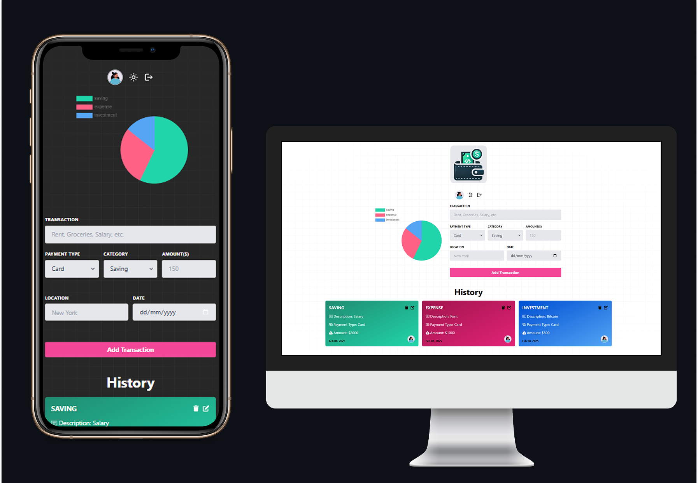

# Cost Control (Tracker)

A web application that enables users to track their spending efficiently.



## Features
- User registration and authorization
- Personal account with chart of spendings
- CRUD of transactions
- Database management

## Tech Stack
**Frontend:** Next.js, React, TypeScript, GraphQL (Apollo Client), Tailwind CSS  
**Backend:** Node.js, Express, GraphQL (Apollo Server), MongoDB

## Installation & Setup

### Backend Setup
1. Navigate to the backend folder:
   ```sh
   cd back
   ```
2. Install dependencies:
   ```sh
   npm install
   ```
3. Start the backend server:
   ```sh
   npm run dev
   ```

### Frontend Setup
1. Navigate to the frontend folder:
   ```sh
   cd front
   ```
2. Install dependencies:
   ```sh
   npm install
   ```
3. Start the frontend application:
   ```sh
   npm start
   
